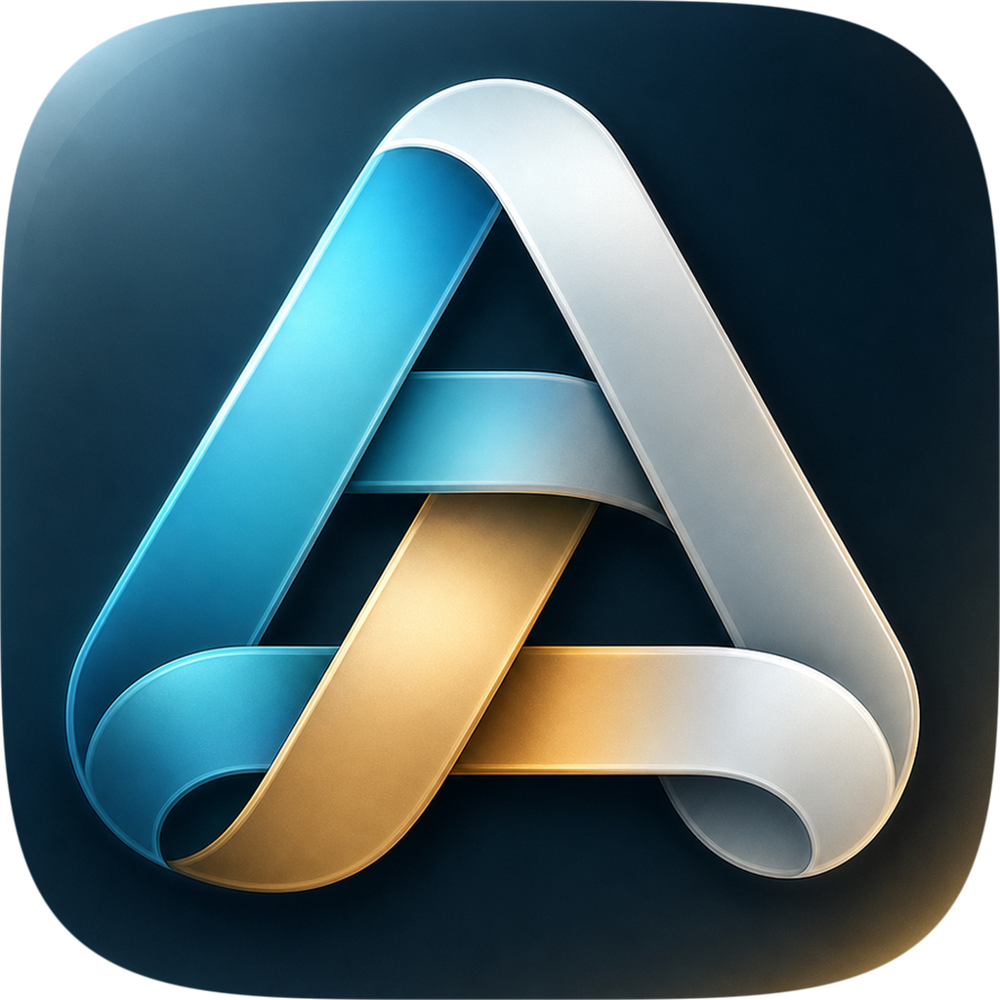

<p align="center">
  
</p>

<h1 align="center">Aetherloom</h1>

<p align="center"><b>Every drive, one weave.</b></p>

<p align="center">
  An open-source native macOS app that keeps your folders safely in sync across the clouds and
  storage you control.
</p>

<p align="center">
  Use the cloud features you like without locking your files into one provider or place.
</p>

<p align="center">
  <a href="https://github.com/alexfilipe/aetherloom/actions/workflows/ci.yml"></a>&nbsp;&nbsp;&nbsp;
</p>

<p align="center">
  <a href="https://aetherloom.app">aetherloom.app</a>
</p>

---

## Why Aetherloom

Files that live in only one place are one failure away from being out of reach: a locked account, an expired subscription, a dead disk, or a service you decide to leave. If you already use more than one cloud, plus a Mac and maybe a NAS, you have everything you need to be resilient — keeping the copies aligned by hand is the tedious, error-prone part.

Aetherloom keeps the same files synchronized across different cloud ecosystems, so you can use the features you like from each provider while keeping complete, readable copies in more than one place:

- **Use each provider for what it does best.** Keep working across iCloud Drive, Google Drive, OneDrive, and later Dropbox without making one ecosystem the only home for your files.
- **Own readable copies.** A synced folder on your Mac or NAS is plain files on hardware you control — readable with or without Aetherloom.
- **Sync across clouds.** Keep a folder identical in iCloud Drive, Google Drive, and OneDrive at the same time.
- **Bring the NAS in.** Folders on SMB/AFP/NFS mounts are first-class sync locations.
- **See before it happens.** Every sync is planned first, and you can preview exactly what will change.

## Safety first

Sync tools have a long history of eating files. Aetherloom is built around the opposite bias: **your files stay under your control.**

- Files are **never permanently deleted** during normal sync — deletes go to each provider's trash.
- An outage, expired login, or unmounted drive is treated as *unavailable*, **never** as "the user deleted everything".
- Files edited in two places are **never silently overwritten** — both versions are preserved.
- Suspicious mass deletions or edits **pause sync** until you review them.

> This file changed in more than one place. Aetherloom preserved both versions.

## AI that advises, never decides

When a file changes in more than one place, Aetherloom keeps every version — and on Apple Silicon Macs it can also help you review the conflict, suggesting which version to keep with a plain-language reason ("edited most recently", "the other version is empty").

- **Entirely on-device.** Suggestions are generated locally on your Mac; your files and their names never leave your machine.
- **Advisory only.** The AI suggests, you decide — a suggestion can never delete, overwrite, or sync anything by itself.
- **Optional.** Aetherloom works exactly the same with it turned off.

The full design, including the hard safety boundaries, is in [architecture/07-ai-conflict-advisor.md](architecture/07-ai-conflict-advisor.md).

## Status

Aetherloom is in **early development** and not yet available to download. The foundation is already taking shape: safe sync plans, conflict preservation, approval gates, and a provider-agnostic engine for keeping files aligned across the places you choose.

Follow progress, open issues, or contribute on GitHub; the project website is [aetherloom.app](https://aetherloom.app).

## Repository layout

```text
src/AetherloomApp/    SwiftUI macOS app (UI only)
src/AetherloomCore/   Swift package with the sync engine
architecture/         Engine design documentation
www/                  Project website
```

Curious how it works — or want to contribute? The full engine design (provider-agnostic sync architecture, conflict preservation, safe-delete flows, approval gates, mock providers for testing, on-device AI advice, testing strategy) lives in [architecture/](architecture/README.md).

## AI-first development workflow

Aetherloom is also an experiment in AI-first software development: architecture, product direction, review, and safety decisions are coordinated by a human developer while AI agents help implement and iterate on the codebase.

## Building

Requirements: Xcode 26+ on macOS.

```bash
cd src/AetherloomApp
xcodebuild -project AetherloomApp.xcodeproj -scheme AetherloomApp -destination 'platform=macOS' build
```

Or open `src/AetherloomApp/AetherloomApp.xcodeproj` in Xcode and hit Run.

## Testing

```bash
swift test --package-path src/AetherloomCore
```

Core tests use mock providers for testing — no network, no real user data.

## Not a backup replacement

Lose access to one location, and your files still live elsewhere as complete, readable copies. Aetherloom improves availability, but sync is not a replacement for versioned backup.

## Contributing

The ground rules are simple:

- Data safety beats speed, convenience, and feature breadth — always.
- Sync logic goes in `src/AetherloomCore` with tests, never in SwiftUI views.
- Run `swift test --package-path src/AetherloomCore` before submitting changes.

Start with [architecture/README.md](architecture/README.md) for how the engine fits together.

## Contact

For questions, feedback, or anything that shouldn't be a GitHub issue: [hello@aetherloom.app](mailto:hello@aetherloom.app).

## License

Aetherloom is licensed under the Apache License 2.0. See [LICENSE](LICENSE) for details.
